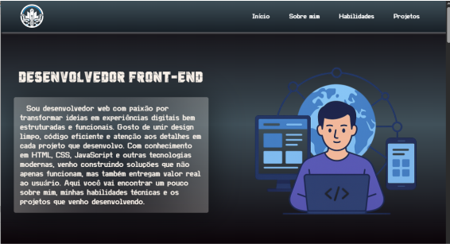

# portfólio-page 💻

Uma página de portfólio pessoal para apresentar meu perfil profissional, habilidades e projetos.

## Descrição 📄
Este projeto é o meu site de portfólio pessoal, desenvolvido para mostrar meu trabalho como desenvolvedor front-end. Ele inclui seções sobre mim, minhas habilidades técnicas e uma coleção de projetos em que trabalhei. O objetivo do site é proporcionar uma experiência de usuário limpa, funcional e intuitiva.

## 📸 Demonstração

## Tecnologias Utilizadas 🛠️

* **HTML5**: Para a estrutura e o conteúdo das páginas web.
* **CSS3**: Para estilização e layout, incluindo design responsivo e animações.
    * **Fontes Personalizadas**: `Origin`, `Cyborg` e `Typelight` são usadas para uma tipografia distintiva.
    * **Variáveis CSS**: Utilizadas para um tema consistente e fácil gerenciamento de cores.
* **JavaScript**: Para elementos interativos, como a funcionalidade do menu de navegação.

## Estrutura de Diretórios 📁

O projeto está organizado na seguinte estrutura de diretórios:

portfolio-page/  
├── src/  
│   ├── fonts/  
│   │   ├── Cyborg Punk.ttf  
│   │   ├── OriginTech personal use.ttf  
│   │   └── TypeLightSans-KV84p.otf  
│   ├── images/  
│   │   ├── css-logo.png  
│   │   ├── curiosidades-tecnologia.png  
│   │   ├── email.png  
│   │   ├── favicon.ico  
│   │   ├── github.png  
│   │   ├── global-dev.png  
│   │   ├── html-logo.png  
│   │   ├── insta.png  
│   │   ├── jogo-da-velha.png  
│   │   ├── js-logo.png  
│   │   ├── linkedin.png  
│   │   ├── logo-header.png  
│   │   ├── minha-foto.png  
│   │   ├── preview.png  
│   │   ├── projeto-magickai.png  
│   │   ├── social-media-links-project.png  
│   │   ├── whatsapp.png  
│   │   └── projeto-lista-de-tarefas.png  
│   ├── scripts/  
│   │   └── script.js  
│   └── styles/  
│       ├── media.css  
│       ├── reset.css  
│       └── style.css  
├── .gitignore  
├── index.html  
├── LICENSE  
├── README.md  

## Como Acessar 🌐

Você pode visualizar a página do portfólio online acessando:
[https://charlesson-mp.github.io/portfolio-page/](https://charlesson-mp.github.io/portfolio-page/)